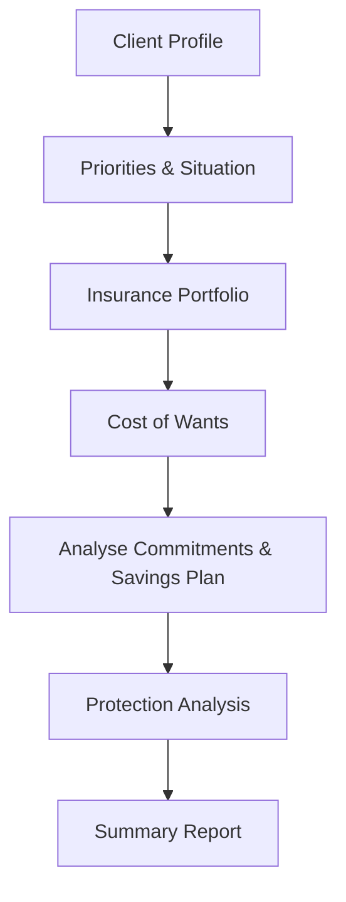
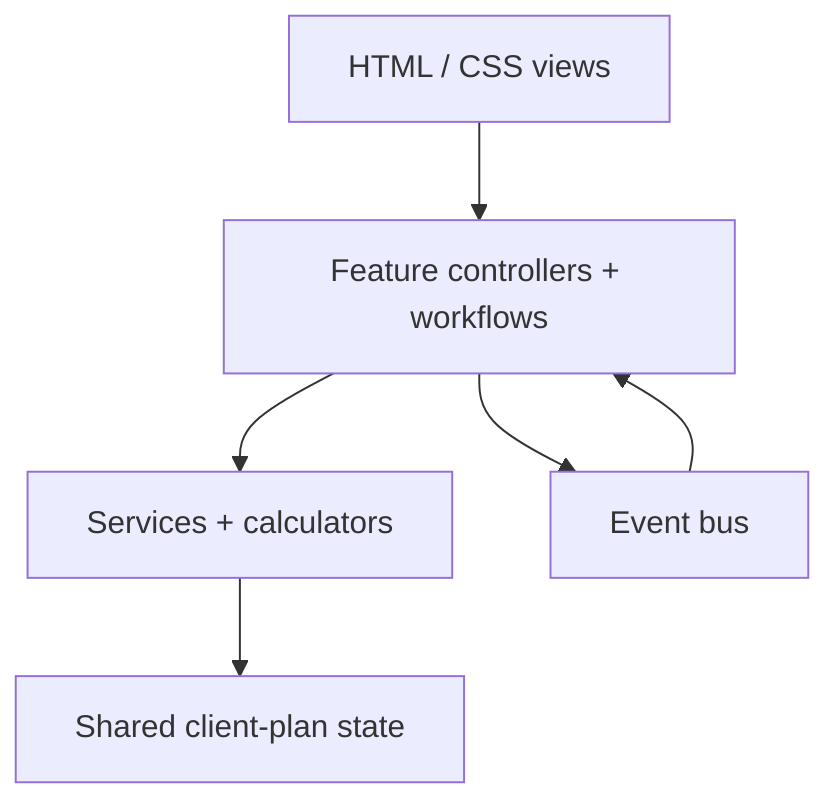

# Financial Planning Workspace

A browser-based Singapore financial-planning workspace for turning a client's current position into a practical retirement and protection plan.

The product is deliberately being designed for younger clients — early-career users, fresh graduates, and people who may be seeing CPF and insurance-planning concepts for the first time. The core UX goal is therefore simple:

> **Show me the lifestyle I want, show me what I have today, and show me the choices that can help me close the gap.**

The application currently covers client data collection, priorities and cashflow inputs, an insurance portfolio, a simplified **Cost of Wants** retirement target, detailed cashflow and CPF projections, and an **Analyse Commitments & Savings Plan** workflow. Protection Analysis and the final Summary Report are the next major product areas.

> [!IMPORTANT]
> This project is a planning and educational tool, not financial, tax, legal, insurance, investment, or CPF advice. CPF rules, insurer product terms, premiums, payout illustrations, contribution rates and public-policy thresholds change. Published values should be revalidated against the relevant official source before production use. Values explicitly labelled **Estimated / Projected** in this README are application assumptions, not values published or guaranteed by CPF Board, MOH, an insurer, or another authority.

## Status at this checkpoint

Documentation checkpoint: **6 August 2026**.

The codebase has completed a full manual/static cleanup pass. The last audited project contained roughly 36.7k lines across 105 JavaScript files, 8 CSS files and 3 HTML files. The audit confirmed that JavaScript modules parse, relative import/export links resolve, HTML IDs are unique, literal `getElementById()` targets and label targets exist, CSS braces are balanced, and shared `clientPlan` state remains private to the state module. Redundant/dead CSS and obsolete code identified during the audit were subsequently removed.

Two intentional development conveniences remain:

- Supabase authentication is still used only as a lightweight access gate; the financial plan itself is not persisted to a production database.
- `DEV_MODE` and the development seed are still enabled for rapid testing. Both must be removed/disabled before production handoff.

## Product workflow

The current planner flow is:



The responsibilities are intentionally separated:

| Area | Question it answers | Current state |
|---|---|---|
| Client Profile | Who is the client? | Implemented |
| Priorities & Situation | What do they own, earn, spend, owe and want? | Implemented |
| Insurance Portfolio | What insurance do they already have and what does it cost? | Implemented and integrated |
| Cost of Wants | What retirement lifestyle do they want? | Implemented; simplified for younger users |
| Analyse Commitments & Savings Plan | What do they have now and what could their choices achieve? | Core engine implemented; UX/refinement ongoing |
| Protection Analysis | How much protection is enough? | Planned / placeholder |
| Summary Report | What should the client take away from the session? | Planned / placeholder |

## Design philosophy

### 1. Simple first, detail on demand

The app originally exposed a lot of CPF and cashflow detail directly. That works for a technically minded near-retiree, but not for the intended early-career audience. The current direction is to lead with four understandable ideas:

1. **Your Goal** — the lifestyle target.
2. **Your Starting Position** — what exists today.
3. **Your Projected Position** — what current behaviour may produce.
4. **Your Next Steps** — what resources the client actually wants to allocate.

The cashflow and CPF-flow tables remain available for advisers and curious users, but they are collapsed by default.

### 2. Cost of Wants is the target, Analysis is the reality check

Cost of Wants deliberately avoids pretending the client already has CPF LIFE, investments or assets available. It answers **"what would this lifestyle cost?"**

Analysis then asks **"given the client's real resources and recurring income, what capital still needs to be funded?"**

### 3. Never double-count a source

Where the planner has both a quick-entry value and a detailed source, the detailed source wins. The most important example is insurance premium:

- if the Insurance Portfolio contains policies, the planner uses portfolio-derived cash premiums;
- if no policies exist, it falls back to the insurance-premium value from Priorities & Situation;
- the two are never added together.

### 4. Published rules and projections are visibly different

This is especially important for future CPF values. Confirmed tables are used where available. Beyond their published range the application uses explicit projection assumptions, records the basis, and surfaces helper text such as **"How is the BHS calculated?"** and **"How is the capital calculated?"**.

## Technology and architecture

The application is intentionally lightweight:

- HTML5
- CSS3
- vanilla JavaScript using ES modules
- Supabase JS v2 for the current authentication gate/profile lookup
- Font Awesome for UI icons
- no build step and no framework runtime
- planner data held in browser memory through a shared state module

Because ES modules are used, serve the project through HTTP rather than opening `client.html` directly with `file://`.

### Architecture



The project has been progressively refactored away from page-sized scripts into feature-focused modules. Common patterns are:

- `*-elements.js` — DOM lookups
- `*-event-binder.js` — event registration
- `*-form-data.js` / `*-form-writer.js` — DOM ↔ data mapping
- `*-validation.js` / `*-validator.js` — validation rules
- `*-renderer.js` / `*-display.js` — UI rendering
- `*-controller.js` — UI orchestration
- `*-workflow.js` — add/edit/save lifecycle
- `*-service.js` — reusable business rules
- `*-calculator.js` — pure calculation-oriented logic

### Important directories

```text
Test-main/
├── index.html                    # Login
├── dashboard.html                # Authenticated dashboard
├── client.html                   # Main financial-planning workspace
├── css/
│   ├── global.css
│   ├── client.css
│   ├── dashboard.css
│   ├── login.css
│   ├── components/
│   └── layout/
└── js/
    ├── client.js                 # Workspace bootstrapping
    ├── dashboard.js
    ├── login.js
    ├── supabase.js
    ├── components/
    ├── constants/
    ├── events/
    ├── factories/
    ├── modules/
    │   ├── assets-income/
    │   ├── goals/
    │   ├── insurance/
    │   ├── liabilities/
    │   ├── properties/
    │   ├── cost-of-wants/
    │   ├── cost-of-wants-preview.js
    │   └── cost-analysis.js
    ├── services/
    ├── state/
    │   └── client-plan.js
    └── utils/
        └── dev-seed.js
```

`cost-analysis.js` is still the largest concentration of projection logic and is the clearest candidate for a future extraction/refactor once behaviour is locked by automated tests.

## Shared state and events

`js/state/client-plan.js` owns the private `clientPlan` object. Feature modules access it through exported selectors and mutation functions rather than importing the state object directly.

The top-level shape is conceptually:

```js
{
  profile: { ... },
  priorities: {
    selectedWealthTypes: [],
    assets: {
      liquidAssets: { ... },
      income: { ... },
      cpf: { oa, sa, ma, ra },
      properties: []
    },
    expenses: { ... },
    commitments: { insurancePremiums },
    goals: [],
    liabilities: [],
    policies: []
  },
  costOfWants: { ... },
  summary: {},
  metadata: { createdAt, updatedAt }
}
```

The event bus (`js/events/event-bus.js` + `js/events/events.js`) lets modules refresh dependent views without tightly coupling DOM implementations.

## Implemented modules

### Client Profile

Captures personal information used throughout projections, including:

- full name
- date of birth
- gender
- marital status
- occupation
- employment status
- dependants
- contact details

Date of birth drives age-sensitive CPF contribution, allocation, BHS, RA formation, CPF LIFE start, disability coverage validation and projection timing.

### Priorities & Situation

This is the primary current-position input area. It contains:

- wealth-type selections
- liquid/withdrawable assets
- employment or self-employed income
- CPF OA / SA / MA / RA balances
- properties
- living expenses
- goals
- liabilities
- quick-entry insurance premium fallback

#### Full-time employment

The current model uses monthly gross employment income, annual bonus and other monthly income. Employee CPF is calculated from the published 2027 rate assumptions described later.

#### Self-employed income

Switching employment status to self-employed changes the income model to annual net trade income (NTI), net platform earnings, other monthly income and mandatory MediSave. Employment-status-specific income is cleared on switch so stale salary/NTI data cannot leak into other projections. Other planner data — goals, assets, CPF, liabilities, properties, policies and Cost of Wants — is preserved.

The UI retains **Annual Take-home Income** as the comparable annual summary.

### Goals

Goals are recorded separately from ordinary monthly expenses. They become selectable big-ticket outflows in the cashflow projection so users can include or exclude goals and immediately see the effect on the projected balance.

For long projections, goals falling within the first/current projection year are preserved rather than disappearing when the table switches from monthly to annual rows.

### Liabilities and property financing

Liabilities support interest-aware repayment calculation and recorded repayment/end timing. Projected cashflow treats the repayment itself as fixed rather than inflating it with general living expenses.

Property data can identify CPF OA-funded housing repayment. This is modelled as a CPF outflow rather than a second cash expense.

### Insurance Portfolio

The portfolio is both a protection record and a cashflow source. It has evolved from a generic policy/benefit form into policy-type-aware behaviour.

#### Premium source priority

The shared commitment service implements the planner-wide rule:

1. Portfolio policies exist → use portfolio-derived cash premium.
2. Portfolio is empty → use Priorities & Situation insurance premium.

This rule is used by current cashflow and projections so insurance is not double-counted.

#### Policy status / payment terms

Where applicable, policies support:

- Active (Regular-Pay)
- Active (Limited-Pay)
- Active (Paid-up)

Limited-pay and coverage-end fields stop future premiums at the appropriate time rather than assuming every policy is payable for life.

#### Hospitalisation

Hospitalisation is handled at policy level rather than asking the user to create a generic hospitalisation benefit.

Current fields/behaviour include:

- policy name
- Hospitalisation policy type
- life assured
- insurer
- optional policy number
- ward type: B2, B1, A Ward, Private Hospital
- annual base premium
- Hospitalisation Rider switch
- rider type: B Ward, A Ward, Private, Private (Panel)
- annual rider premium
- premium payment split: MediSave and cash

Only the base Integrated Shield component is eligible for the modelled Additional Withdrawal Limit (AWL). Rider premium is cash-paid. The base-plan MediSave amount is editable because actual insurer/MediShield Life billing can differ.

The **cash** portion feeds the cashflow/commitment outflow. The **MediSave** portion feeds the CPF/MA outflow.

MediShield Life premium is intentionally not auto-added to the estimate because it depends on factors outside the current data model. The application also does not attempt to dynamically reprice insurer base/rider premiums by age or future product repricing.

#### Long-term care

Base ElderShield/CareShield selection is kept separate from supplement premium planning. Supplement premiums are annual. The payment split supports MediSave and cash, with up to $600/year modelled as MediSave-usable for supplements. Supplement benefits remain user-entered because product structures differ.

The cash portion feeds cashflow; the MediSave portion feeds MA/CPF flow.

#### Endowment

Endowment maturity is treated as a **one-off asset inflow**, not recurring retirement income. Recorded maturity proceeds can therefore contribute to withdrawable resources / the retirement funding plan.

#### Retirement / income policy

Retirement-policy payout is treated as **recurring cashflow** starting at the recorded payout age. It can be lifetime or limited-duration. Payouts may start before age 65 and reduce the amount that personal retirement capital must fund from the date they begin.

#### Investment (Accumulation)

Investment/accumulation policies can store:

- current policy value
- valuation date
- optional projected policy value
- projected-at age

If a directly recorded projected value at FYBC is unavailable, Analysis can project the current policy value to FYBC using an editable investment growth assumption. The current default is 4% p.a. This is an application planning assumption, not a guaranteed policy return.

#### Disability income

For employed clients, disability-income benefits are validated against a maximum of 75% of average gross monthly employment income (`monthly salary + annual bonus / 12`). Coverage-end age defaults to 65 and is editable from 60–70.

Self-employed disability-income validation against NTI has **not** been implemented yet and is a documented roadmap item.

### Cost of Wants

Cost of Wants has been deliberately simplified after early prototypes became too CPF-heavy for the target audience.

The page now asks for only the inputs needed to define the lifestyle target:

- current age — derived from Client Profile
- desired FYBC age
- planned mortality age — default 85
- inflation rate — default 2.5% p.a.
- post-FYBC return rate — default 3.5% p.a., editable
- desired lifestyle in today's dollars: Basic $3,000, Average $5,000, Comfort $8,000, or Custom

The target panel explains:

- time remaining to FYBC
- monthly passive income needed at the FYBC age
- monthly passive income needed at age 65
- estimated lifetime retirement spending

It deliberately does **not** subtract existing assets, CPF LIFE, or insurance income. Those belong in Analysis.

#### Understanding “Estimated lifetime retirement spending”

This is a lifestyle benchmark, not a claim that the client must have that entire amount sitting in cash at FYBC.

For example, a 37-year-old targeting FYBC at 55 with a $5,000/month lifestyle in today's dollars has 18 years of inflation before FYBC. The application first inflates the lifestyle amount and then estimates the retirement-period spending through the selected mortality age. Analysis later applies post-FYBC returns and recorded recurring retirement income to work out a more useful **Capital Needed at FYBC**.

### Analyse Commitments & Savings Plan

This is the most developed analytical feature and currently has two layers: a simple user-facing path and detailed expandable projections.

#### Current monthly cashflow

The current cashflow is explicitly a **today** snapshot. It does not apply future salary increments or expense inflation. The labels have been changed to **Inflow** and **Outflow** to be easier to understand.

Typical inflows:

- take-home employment income or self-employed income
- other monthly income

Typical outflows:

- living expenses
- cash-paid liabilities
- cash-paid insurance premium
- self-employed mandatory MediSave where applicable

#### Cashflow projection

The projection applies future assumptions and events. It supports:

- 10 years — monthly rows
- 20 / 30 / 40 years — annual summary rows
- planned mortality age — annual summary rows when longer than the monthly view

Annual rows use **December** as the period endpoint.

Projection controls/events include:

- annual employment/bonus increment
- expense-inflation override (default sourced from Cost of Wants)
- employment and bonus stop at FYBC
- other monthly income can optionally continue after FYBC
- insurance premium end/status rules
- liability end dates
- retirement-policy payout start/end
- endowment maturity inflow
- CPF LIFE payout start
- selectable big-ticket goals
- FYBC marker

Cells with multiple movements can be opened to show detail such as `Policy matured inflow (+...)`, `Children's Education Paid (-...)`, or limited-payout start/end events.

#### CPF-flow projection

CPF is deliberately separated from withdrawable cashflow. The table tracks:

- CPF contribution inflow
- CPF interest
- combined CPF outflows, with account labels shown only when non-zero
- net CPF flow, showing account-level +/- detail
- OA balance
- **SA / RA Balance**
- MA balance
- applicable BHS

The label changes from SA to RA once the member reaches the RA-formation point. An FRS-met indicator can appear at age 55 where appropriate.

#### Retirement strategy layer

CPF retirement strategy belongs in Analysis, not Cost of Wants.

Current choices distinguish normal/current behaviour from explicit top-up strategies:

- employed client default: **Current Path**
- self-employed default: **No Cash Top-up**
- optional BRS / FRS / ERS strategy choices

For employed clients, the normal RA funding ceiling is the cohort FRS. At 55, SA is used first to form RA; OA is used if SA is insufficient; residual SA moves to OA. After 55, normal CPF retirement allocation/MA overflow fills RA only up to the cohort FRS before excess routes to OA.

An explicit strategy selection is a separate planning choice. It may require a cash top-up. BRS property-pledge eligibility is **not** currently validated.

#### CPF LIFE in Analysis

Only the **Standard Plan** is modelled. The start age selector defaults to 65 and can defer to 70.

The application does not assume that choosing FRS means the client magically has FRS. The affordable CPF LIFE premium is capped by the RA actually projected to be available. If the available premium is lower, the payout estimate is correspondingly lower.

Automatic CPF LIFE treatment currently uses a minimum modelled premium of $60,000. See the assumptions register below.

#### The four-section user path

The simplified Analysis experience is being shaped around:

**1. Your Goal**  
The lifestyle target from Cost of Wants, with an expandable explanation of how retirement lifestyle is estimated.

**2. Your Starting Position**  
Today's withdrawable assets, current CPF position and current positive/negative monthly amount. The point is orientation, not a 30-year forecast.

**3. Your Projected Position / Capital Needed**  
Shows what current behaviour is projected to produce around FYBC, including projected OA after RA formation, projected RA, affordable CPF LIFE premium/income and recurring retirement income. MA is deliberately omitted from the simple summary.

**4. Your Next Steps**  
Lets the client decide what resources they actually want to use rather than automatically consuming all assets/surplus. Candidate resources include current withdrawable assets, investment policies, future endowment proceeds and eligible CPF OA. Current assets include an editable **Amount I Want to Use** field.

The detailed cashflow and CPF-flow sections remain available but are collapsed by default. A future UX improvement is to expose them as sidebar subsections below Analyse Commitments & Savings Plan rather than making users scroll through them.

## Calculation and assumptions register

This section is deliberately detailed. A future developer should be able to tell whether a number is published, calculated from client data, or estimated by this application.

### Classification

| Label | Meaning |
|---|---|
| **Published** | Taken from a published official rule/table for the applicable period represented in the code. |
| **Calculated** | Deterministically calculated from client-entered data and/or published rules. |
| **Estimated / Projected** | A planning assumption or extrapolation implemented by this project; not an official future value or guarantee. |

### Cost of Wants assumptions

| Item | Classification | Current implementation |
|---|---|---|
| Planned mortality age | User input | Default 85; editable. |
| Inflation | User input / assumption | Default 2.5% p.a.; editable. |
| Post-FYBC return | User input / assumption | Default 3.5% p.a.; editable. Used by Analysis capital present-value calculation, not a guaranteed return. |
| Lifestyle presets | Product assumption | Basic $3,000, Average $5,000, Comfort $8,000 per month in today's dollars; Custom available. |

### Monthly income at FYBC / age 65

**Calculated.** Today's desired monthly lifestyle is compounded by the selected inflation rate:

```text
incomeAtTarget = todayMonthlyIncome × (1 + inflationRate) ^ yearsUntilTarget
```

### Capital Needed at FYBC

**Calculated using user-selected planning assumptions.** This is more meaningful than the gross lifetime-spending figure because it applies the post-FYBC return assumption and recurring income that reduces the lifestyle amount the client's own capital must fund.

The engine runs month by month from FYBC through the selected mortality date:

```text
monthlyInflation = (1 + annualInflation)^(1/12) - 1
monthlyReturn    = (1 + annualPostFybcReturn)^(1/12) - 1

lifestyle(month) = incomeAtFybc × (1 + monthlyInflation)^monthIndex

usableRecurringIncome(month) =
  otherMonthlyIncome (if the client chose for it to continue)
  + active retirement-policy income
  + applicable CPF LIFE income

capitalFundedSpending(month) =
  max(lifestyle(month) - usableRecurringIncome(month), 0)

presentValueAtFybc(month) =
  capitalFundedSpending(month) / (1 + monthlyReturn)^monthIndex

Capital Needed at FYBC = sum(presentValueAtFybc for all retirement months)
```

Recurring income is not allowed to reduce required spending below zero. Retirement-policy income starts at the age/date recorded in the policy, not automatically at 65.

### CPF contribution rules

**Published basis, 2027 rates.** The planner uses the 2027 CPF contribution framework as the future projection baseline for Singapore Citizens and third-year PRs and above, where monthly wages exceed $750.

Current full-rate age bands:

| Age | Employee | Employer |
|---|---:|---:|
| 55 and below | 20% | 17% |
| Above 55–60 | 19% | 16.5% |
| Above 60–65 | 13% | 13% |
| Above 65–70 | 7.5% | 9% |
| Above 70 | 5% | 7.5% |

The final cleanup changed age-boundary comparisons so transitions happen at the correct birthday boundary. CPF calculation rounding follows the published rule implemented in the latest cleanup: total contribution to nearest dollar, employee share cents dropped, employer share as the balance.

**Known limitation:** graduated CPF contribution bands for very low monthly wages (≤$750), PR first/second-year rates and other special contribution categories are not implemented.

### CPF allocation rules

**Published basis, 2027 allocation table.** `js/services/cpf-service.js` stores age-based OA / retirement-account / MA allocation ratios. `retirementAccount` means SA before 55 and RA after 55.

### CPF base and extra interest

**Published basis, calculated monthly.** Current assumptions:

- OA base interest: 2.5% p.a.
- SA / RA / MA base interest: 4% p.a.
- below 55: +1% on the first $60,000 of combined balances, with OA capped at $20,000 for extra-interest eligibility
- age 55+: +2% on the first $30,000 and +1% on the next $30,000 of combined balances, with the same OA $20,000 cap
- account priority below 55: OA → SA → MA
- account priority at/after 55: RA → OA → SA → MA
- extra interest attributable to OA is credited to SA before 55 or RA after 55
- interest is accumulated monthly in the projection and credited in the model's annual/December flow

**Deliberate model choice:** after CPF LIFE premium is deducted from RA, this project does not continue to calculate/show interest on that CPF LIFE premium. CPF materials state CPF LIFE savings may continue to earn applicable extra interest, but the planner omits it from the visible projected account model so the removed RA premium is not represented as a balance the client can see/use.

### RA formation and FRS routing

**Calculated using published retirement sums plus project strategy rules.** At the member's 55 transition:

1. Use SA to form RA up to the applicable cohort FRS/current-path target.
2. If SA is insufficient, use OA.
3. Residual SA is moved to OA after RA formation.
4. Subsequent normal retirement allocations/eligible BHS overflow fill RA only up to the cohort FRS before excess routes to OA.

Explicit BRS/FRS/ERS strategy top-ups are kept separate from this normal routing.

### Published retirement sums and future projection

**Published through 2027; Estimated / Projected afterward.** The calculator contains historical values back to the supported 2015 cohort logic, including the 1 July 2015 retirement-sum split required for the 1960 birth cohort.

Important ERS handling:

- 2022–2024 ERS = 1.5× FRS
- from 2025 ERS = 2× FRS
- projected years are after the January 2025 ERS enhancement, so projected ERS uses 2× projected FRS

For a cohort turning 55 after the latest published year:

```text
projectedFRS = 2027 FRS × (1 + retirementSumGrowthRate) ^ yearsAfter2027
projectedBRS = projectedFRS / 2
projectedERS = projectedFRS × 2
```

Current default retirement-sum growth assumption: **3.5% p.a.**  
Projected retirement sums are rounded to the nearest **$100**.

This 3.5% is an internal planning assumption and must be replaced by new published CPF values as they become available.

### CPF LIFE payout estimator

**Published inputs + application Estimate.** The project models **CPF LIFE Standard Plan only**. Basic and Escalating Plan calculations are intentionally out of scope at this stage.

Published/current cohort examples are used where explicitly stored. For future/non-mapped payouts, the app uses a locked internal linear estimator calibrated around the project's 2026 basis:

```text
Male monthly payout   = 100 + CPF LIFE premium × 0.00507067220929381
Female monthly payout = 120 + CPF LIFE premium × 0.004685336151938148

result rounded to nearest $10
```

This formula is **not CPF Board's published calculation formula**. It is an application estimator and must remain labelled as such.

The CPF LIFE premium used in Analysis is the amount the projected RA can actually afford, capped by the chosen strategy target. The model does not automatically grant FRS to a client who has insufficient RA.

Default payout start age is 65; user may defer to 70. The project models deferral primarily by keeping eligible RA funds in the account and applying the modelled RA growth/premium path before estimating the payout. It does not attempt to reproduce every actuarial factor used by CPF LIFE.

The UI includes calculation/helper disclosure so the estimated payout can be explained rather than presented as guaranteed.

### Basic Healthcare Sum (BHS)

**Published through 2026; Estimated / Projected afterward.** Confirmed values stored by the application:

| Year/cohort year | BHS |
|---:|---:|
| 2016 or earlier supported cohort | $49,800 |
| 2017 | $52,000 |
| 2018 | $54,500 |
| 2019 | $57,200 |
| 2020 | $60,000 |
| 2021 | $63,000 |
| 2022 | $66,000 |
| 2023 | $68,500 |
| 2024 | $71,500 |
| 2025 | $75,500 |
| 2026 | $79,000 |

For years after 2026, the project uses:

```text
nextYearBHS = previousYearBHS × 1.0472
round each projected year to nearest $500
```

The 4.72% rate is an **application projection assumption** based on prior BHS progression, not a published future CPF increase.

For a client below 65, the projection uses each year's applicable BHS until the year they turn 65. Their age-65 cohort BHS is then fixed for life. Existing opening MA above a modelled BHS is preserved; the cap controls routing of new inflow rather than deleting the entered balance.

When new MA inflow would exceed BHS:

- under 55 → overflow to SA;
- age 55+ → overflow to RA up to cohort FRS, then OA.

The interface labels this value as the **Projected Cohort BHS at Age 65** where appropriate so users do not mistake the current $79,000 confirmed 2026 BHS for their own future cohort limit.

### Hospitalisation MediSave AWL

**Published rule, dynamically calculated.** The hospitalisation policy stores the amount entered today, but CPF flow can vary the allowable base-plan MediSave payment as the client ages:

- age next birthday 40 or below: $300/year
- 41–70: $600/year
- 71+: $900/year

The model caps the MediSave amount by the base annual premium. Rider premium is cash-only.

**Not modelled:** future insurer base-plan/rider repricing and the client-specific MediShield Life premium. Therefore, the cash portion is not dynamically repriced by the planner.

### Long-term care MediSave

**Published rule.** CareShield Life/ElderShield supplement planning allows up to **$600/year per insured** from MediSave for supplement premiums. Cash above the entered MediSave portion remains a cashflow commitment.

### Self-employed mandatory MediSave

**Published 2026 basis used as a future planning assumption.** Until a 2027 SEP table is incorporated, the application uses the 2026 non-pensioner SEP framework.

Net trade income for this purpose excludes recorded net platform earnings:

```text
medisaveNTI = max(annualNetTradeIncome - netPlatformEarnings, 0)
```

Age is evaluated at 1 January. The stored 2026 framework is:

| Age at 1 Jan | $6k–$12k | $12k–$18k phased formula | >$18k | Maximum |
|---|---:|---|---:|---:|
| Below 35 | 4.0% | `480 + 0.16 × (NTI - 12,000)` | 8.0% | $7,680 |
| 35–<45 | 4.5% | `540 + 0.18 × (NTI - 12,000)` | 9.0% | $8,640 |
| 45–<50 | 5.0% | `600 + 0.20 × (NTI - 12,000)` | 10.0% | $9,600 |
| 50+ | 5.25% | `630 + 0.21 × (NTI - 12,000)` | 10.5% | $10,080 |

At/below $6,000 NTI, the current model returns no mandatory contribution. The annual result is divided into monthly projection flow; it is a cash outflow and an MA inflow, after which BHS overflow routing applies. A manual override is supported.

### Salary growth and expense inflation

**User-editable planning assumptions.** Current monthly cashflow remains in today's values. Only the projection applies:

- annual employment/bonus increment (development default around 2% where populated)
- annual expense inflation, initially sourced from Cost of Wants unless the Analysis input is overridden

Liability repayments and ordinary fixed insurance premiums are not automatically inflated. Future hospitalisation/renewable premium repricing is deliberately not guessed.

### Investment-policy growth

**Estimated / Projected.** If a policy has a direct future projected value covering FYBC, that recorded figure can be used. Otherwise, a current policy value and valuation date can be projected to FYBC using the Analysis investment-growth assumption (default 4% p.a., editable).

The user can decide whether to include the resulting investment-policy resource in **Your Next Steps**. It is not silently committed to the retirement goal.

## Data movement into Analysis

| Source | Movement | Destination / effect |
|---|---|---|
| Employment income | recurring inflow until FYBC | Cashflow |
| Annual bonus | smoothed into monthly projection; stops at FYBC | Cashflow |
| Other monthly income | recurring; may optionally continue after FYBC | Cashflow + retirement-capital offset |
| Living expenses | recurring outflow; inflated in projection | Cashflow |
| Liability repayment | recurring until recorded end | Cashflow |
| Property CPF repayment | OA outflow | CPF flow |
| Insurance cash premium | recurring according to payment term | Cashflow |
| Hospitalisation MediSave | MA outflow with age-sensitive AWL | CPF flow |
| LTC supplement MediSave | MA outflow | CPF flow |
| Endowment maturity | one-off inflow/resource | Cashflow + Next Steps resource |
| Retirement-policy payout | recurring from recorded payout start | Cashflow + retirement-capital offset |
| Investment accumulation value | projected resource | Next Steps resource |
| Selected goal | one-off big-ticket outflow | Cashflow projection |
| CPF contributions | OA/SA-or-RA/MA inflow | CPF flow |
| CPF interest | account-specific inflow | CPF flow |
| RA strategy top-up | cash → RA movement | Cashflow + CPF flow |
| CPF LIFE start | RA premium deduction + estimated recurring payout | CPF flow + Cashflow + retirement-capital offset |

Protection benefits such as Death/TPD/CI are **not** treated as expected cashflow inflows. They belong to Protection Analysis rather than the ordinary-life projection.

## Development seed

`js/utils/dev-seed.js` exists solely for repeatable development/testing and is currently enabled. It seeds a representative John Tan scenario including salary, CPF, property, goals, liabilities and multiple insurance policy types.

At the latest verified checkpoint:

- effective portfolio-derived **cash insurance premium** is $3,400/month;
- current hospitalisation MediSave outflow is $300/year = $25/month;
- portfolio policy premium takes precedence over the quick-entry insurance premium;
- the seed includes examples of hospitalisation, whole life, term/CI, disability income, personal accident, ILP/protection, endowment, retirement income and paid-up policies.

Do not treat development-seed values as product defaults or real-client recommendations.

## Current limitations / intentional deferrals

These are product decisions or known gaps, not silent TODOs:

- financial plans are not yet persisted to Supabase/database storage;
- `DEV_MODE` is still enabled for development convenience;
- self-employed disability-income 75% validation is not yet based on NTI;
- CPF contribution handling does not yet support low-wage graduated bands ≤$750;
- PR first/second-year CPF rates are not modelled;
- CPF LIFE models Standard Plan only;
- CPF LIFE estimator is not CPF Board's actuarial formula;
- CPF LIFE premium interest after the premium is removed from RA is not represented;
- clients who have already started CPF LIFE need additional historical-state handling;
- BRS property pledge/charge eligibility is not validated;
- future BHS/FRS/ERS values are projections until official figures replace them;
- 2026 SEP MediSave rules are being carried forward as a planning assumption;
- MediShield Life premium is not auto-calculated;
- future insurer premium repricing is not modelled;
- protection claim events are not treated as ordinary projected inflows;
- taxes, investment taxes/fees, healthcare claim probability and product-specific surrender charges are outside the current model;
- the large `cost-analysis.js` should eventually be split after projection behaviour is covered by automated tests.

## Roadmap

### Completed foundation

- Supabase login/dashboard access gate
- single-page client planning workspace
- shared in-memory client-plan state and reset flow
- event bus
- reusable Planning Card UI pattern
- modular Client Profile / Priorities / Assets / Goals / Liabilities / Properties
- insurance portfolio CRUD + policy-specific forms/validation
- hospitalisation and long-term-care premium split into cash vs MediSave
- endowment, retirement-income and investment-accumulation cashflow/resource behaviours
- insurance premium source precedence
- simplified Cost of Wants
- current monthly cashflow
- multi-horizon cashflow projection with goal inclusion toggles
- expense inflation + income growth
- CPF flow projection
- RA formation + BHS overflow
- CPF base/extra interest model
- future FRS/BRS/ERS projection
- CPF LIFE Standard Plan estimate + 65/70 start
- employed/self-employed income modes + mandatory SEP MediSave estimate
- Analysis resource selection / Your Next Steps foundation
- collapsible technical projection sections
- full dead-code/CSS/import cleanup pass

### In progress / next refinement

- finish the young-user-facing **Your Next Steps** recommendations so the output answers “what can I realistically do next?” without assuming all surplus/assets are committed;
- continue polishing the four-section Analysis story and helper modals;
- move detailed Cashflow and CPF Flow to Analysis sidebar subsections to reduce long-page scrolling;
- add automated regression fixtures before further extracting `cost-analysis.js`;
- replace projected public-policy constants whenever official 2027+ values are published.

### Planned major features

#### Protection Analysis

The next major advice layer should answer:

> **How much protection should I buy so I do not need to keep guessing or repeatedly buying more insurance?**

Planned protection work includes coverage-gap analysis for Death/TPD/CI/ECI, disability-income suitability and an explainable recommendation layer based on liabilities, dependants/expenses, goals and existing portfolio benefits.

#### Summary Report

Planned report output should consolidate:

- the client's desired lifestyle target;
- current position;
- retirement funding gap and chosen resource allocation;
- CPF assumptions and projected support;
- protection gaps/recommendations;
- clear disclosures for estimated values;
- print/PDF-friendly presentation.

#### Production persistence and access control

- persist multiple client plans rather than keeping all planner data in memory;
- repository/persistence layer between state and Supabase;
- production Row Level Security and ownership checks;
- remove development seed and temporary shortcuts;
- add migrations/schema documentation and recovery/versioning strategy.

#### Model hardening

- self-employed disability-income validation;
- low-wage / special CPF contribution cases;
- PR contribution-year handling;
- already-started CPF LIFE cases;
- decide whether BRS property eligibility should be modelled or only disclosed;
- replace projections with official BHS/retirement-sum figures as released;
- consider whether to support CPF LIFE Basic/Escalating only if a trustworthy maintainable calculation basis is available;
- automated numerical regression tests for CPF, cashflow, policy timing and retirement capital.

## Development timeline

This project evolved iteratively rather than being designed fully upfront. The sequence matters because many current architecture choices are the result of lessons from earlier prototypes.

### Phase 1 — Workspace foundation (mid-July 2026)

- Created Supabase-backed login/dashboard access flow.
- Established the `client.html` financial-planning workspace and sidebar.
- Added Client Profile and basic session-only client-plan state.
- Established the privacy direction: entered planning information is not yet saved online.

### Phase 2 — Priorities & Situation

- Consolidated assets, income, CPF, property, expenses, goals and liabilities.
- Added planning-card components and progressively split page scripts into elements/controllers/renderers/calculators/workflows.
- Added liability repayment and property OA-payment logic.

### Phase 3 — Insurance Portfolio

- Built policy/benefit CRUD, validation and portfolio review.
- Separated Hospital Cash from Hospitalisation.
- Reworked Hospitalisation so ward/rider/premium-payment details live at policy level and hospitalisation benefits auto-populate.
- Added MediSave/cash split and dynamic hospitalisation AWL treatment.
- Reworked long-term-care supplement MediSave/cash handling.
- Expanded premium statuses to Regular-Pay / Limited-Pay / Paid-up.
- Added policy timing for whole life, term/CI and disability income.
- Reworked Endowment as maturity capital, Retirement as recurring income, and Investment (Accumulation) as a projected resource.

### Phase 4 — Cost of Wants / CPF retirement exploration

- Built FYBC-age, lifestyle, inflation and mortality calculations.
- Added CPF retirement-sum projections and CPF LIFE payout estimates.
- Early versions exposed large CPF retirement tables and assumed schemes directly on Cost of Wants.
- Product direction was then simplified: Cost of Wants became the clean **“what lifestyle do you want?”** page; strategy choices moved into Analysis.

### Phase 5 — Analyse Commitments & Savings Plan

- Added current monthly cashflow.
- Fixed planner-wide insurance premium precedence.
- Added multi-horizon cashflow projection, selectable goals and December annual summaries.
- Added salary increment, expense inflation and FYBC income stop.
- Added policy maturity/payout events and clickable flow breakdowns.
- Separated CPF Flow from cashflow.
- Added 2027 CPF contributions/allocations, CPF interest, BHS, RA formation and CPF LIFE start logic.
- Added employed Current Path and self-employed No Cash Top-up defaults plus strategy options.
- Added self-employed NTI/MediSave modelling.

### Phase 6 — Young-user UX refocus (late July–early August 2026)

- Confirmed the primary audience as younger users rather than near-retirees.
- Made Cashflow/CPF Flow collapsible and technical by default.
- Introduced the four-part Analysis story: Goal → Starting Position → Projected Position → Next Steps.
- Reworded retirement capital to distinguish lifetime-spending benchmark from required capital at FYBC.
- Added explanation helpers/modals for capital, BHS and recurring retirement income.
- Added opt-in resource allocation rather than automatically consuming every available asset.

### Phase 7 — Audit and documentation checkpoint (5–6 August 2026)

- Performed a project-wide static/manual review for duplicate, redundant, stale and incorrect code.
- Removed obsolete aliases/comments/CSS and fixed remaining boundary/rounding issues.
- Confirmed module/import/DOM/CSS structural integrity.
- Locked the present calculation/assumption register for handover documentation.
- Prepared this README and the companion Developer Handover document.

## Testing approach at this checkpoint

The project has mainly been verified through seeded end-to-end scenarios and static code review. The development seed intentionally touches many policy and projection paths.

Before production, add automated tests around at least:

- age boundary transitions (35/45/50/55/60/65/70);
- exact DOB month vs FYBC/RA/CPF LIFE transition;
- CPF rounding;
- BHS overflow routing;
- RA formation using SA then OA;
- FRS/ERS historical vs projected factors;
- CPF LIFE premium affordability and payout estimate;
- hospitalisation AWL at age-next-birthday boundaries;
- policy regular/limited/paid-up premium timing;
- endowment maturity and retirement payout start/end boundaries;
- goal dates in monthly vs annual projection;
- expense inflation and employment increment;
- insurance portfolio vs quick-entry premium precedence;
- self-employed MediSave bands and NTI/platform-earnings exclusion;
- retirement-capital present-value calculation.

## Local development

There is no package/build step in the current archive. Use any static HTTP server from the project root, then open `index.html`.

Example with Python installed:

```bash
python -m http.server 8000
```

Then visit `http://localhost:8000/`.

Authentication currently expects the configured Supabase project and a valid user/profile. During development, the planner also loads `DEV_MODE` seed data after entering the workspace.

> [!CAUTION]
> Do not put a Supabase `service_role` key or any other server secret in browser JavaScript. Only browser-safe/publishable credentials belong client-side. Production data access must be protected by RLS and plan ownership checks.

## Official references used by the model

These are the primary references that should be rechecked whenever the model is updated:

- CPF — 2027 contribution-rate changes: <https://www.cpf.gov.sg/employer/infohub/news/cpf-related-announcements/new-contribution-rates>
- CPF — 2027 allocation rates: <https://www.cpf.gov.sg/content/dam/web/employer/employer-obligations/documents/jan2027cpfallocationrates.pdf>
- CPF — contribution calculation/rounding: <https://www.cpf.gov.sg/employer/employer-obligations/how-much-cpf-contributions-to-pay>
- CPF — interest rates: <https://www.cpf.gov.sg/service/article/what-are-the-cpf-interest-rates>
- CPF — extra interest: <https://www.cpf.gov.sg/member/growing-your-savings/earning-higher-returns/earning-attractive-interest>
- CPF — Basic Healthcare Sum: <https://www.cpf.gov.sg/service/article/what-is-the-basic-healthcare-sum>
- CPF — Retirement Sums: <https://www.cpf.gov.sg/member/infohub/educational-resources/what-is-the-cpf-retirement-sum>
- CPF — CPF LIFE: <https://www.cpf.gov.sg/member/retirement-income/monthly-payouts/cpf-life>
- CPF — CPF LIFE payout examples: <https://www.cpf.gov.sg/service/article/how-much-cpf-payouts-can-i-get-every-month>
- CPF — Self-employed MediSave calculator: <https://www.cpf.gov.sg/member/tools-and-services/calculators/self-employed-medisave-contribution-calculator>
- MOH — Integrated Shield Plans: <https://www.moh.gov.sg/managing-expenses/schemes-and-subsidies/integrated-shield-plans/about-integrated-shield-plans/>
- CPF — CareShield Life/ElderShield supplements: <https://www.cpf.gov.sg/service/article/what-are-careshield-life-and-eldershield-supplement-plans>

## Handover rule for future development

When changing a financial rule:

1. Identify whether it is **Published**, **Calculated**, or **Estimated / Projected**.
2. Put general business logic in a reusable service/calculator, not a page renderer.
3. Avoid calculating the same concept independently in Cost of Wants and Analysis.
4. Update the helper/disclosure text visible to the user.
5. Add/update a regression test or development fixture.
6. Update this assumptions register and the Developer Handover.
7. If an official value supersedes a projection, replace the projected value rather than layering exceptions on top of it.

The project should stay understandable enough that an adviser can explain every important number to a young client without saying “the system just calculated it.”
